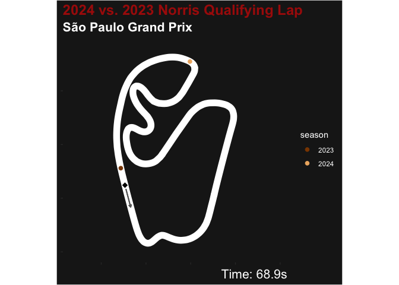
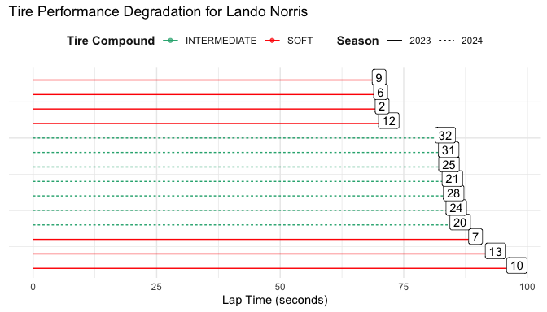

# Interactive Analysis of Formula 1 Qualifying Data

## Visualizing Formula 1 Qualifying Laps

In this project, we focus on analyzing motorsport telemetry data, using
data from the 2018 to 2024 Formula 1 (F1) seasons. Formula 1 has a vast
amount of data used widely in the sport, making it perfect for
visualization and analysis. This project centers on the analysis of F1
qualifying sessions, highlighting comparisons between two drivers in the
same race or the same driver across different seasons. We built a Shiny
application to allow users to interactively explore qualifying data and
create custom visualizations by selecting drivers, seasons, and
circuits. As case studies, we look at different qualifying sessions
across years with the same driver and across drivers during the same
race.

The Shiny app built leverages Formula 1 telemetry data to create the
plots for exploring and animating qualifying laps. The full app can be
found at <https://stlawu.shinyapps.io/f1-qualifying-app/>. The app has
three tabs: an outline/instruction page, an exploration page, and an
animation page.

### f1dataR and Shiny

This project uses the `f1dataR` package to develop a Shiny web
application used to visualize and compare qualifying laps. The `f1dataR`
package is an R interface to access Formula 1 data, developed to make
use of statistical tools in R with detailed motorsport telemetry and
timing information. `f1dataR` leverages both the Jolpica API (formerly
known as Ergast) for historical and session metadata, and a wrapper
around the FastF1 Python library to extract rich telemetry data directly
from F1’s live timing systems.

### São Paulo Grand Prix

We look at a case study to observe some of the different plots and
outputs that users will see when using the app. This case study will
compare laps from the 2023 and 2024 São Paulo Grand Prix. These two
qualifying sessions highlight the difference between wet and dry weather
driving conditions, which might create the most significant differential
in lap times. This season comparison highlights how wet weather
conditions in 2023 led to significantly slower lap times compared to the
dry conditions in 2024, as the on-track positions for Lando Norris
between the two seasons are drastically far from each other.

It is important to note that there is some variance in lap times from
year to year due to car and driver development, but keeping the driver
(and constructor) the same seeks to mitigate some of the variance. We
will see more examples later in this section about how qualifying lap
times vary between teammates and constructors.

| driver_code | season | constructor_id | lap_time | lap_number |   compound   | grid |
|:-----------:|:------:|:--------------:|:--------:|:----------:|:------------:|:----:|
|     NOR     |  2024  |    mclaren     |  83.405  |     32     | INTERMEDIATE |  1   |
|     NOR     |  2023  |    mclaren     |  70.021  |     9      |     SOFT     |  6   |

Qualifying results for Lando Norris.

In this plot, we see that the positioning of Norris between the two
seasons is vastly different. In the dry conditions of 2023, Norris is
almost completed with his lap, while in 2024 he still has three turns to
go. Wet versus dry conditions typically cause the largest gaps in
qualifying due to how difficult wet conditions are to drive in.

The plot above shows the seven fastest times from Lando Norris during
the 2023 and 2024 qualifying sessions. We can see that the laps from
2024 were driven on intermediate tires, which are one of the two types
of tires used in wet conditions. Unlike the soft, medium, or hard tires,
intermediates and wet tires have additional tread on them to help
displace water that sits on the track. While this makes the cars safer
to drive in wet conditions, it makes them considerably slower.

### Formula 1 and Qualifying

Formula 1 (F1) is a global motorsport series featuring 20 drivers from
10 teams (“constructors”) competing across a season of 18–24 races. Each
race weekend includes practice, qualifying, and the main race, with
qualifying determining the starting order through a three-stage knockout
format. Points are awarded based on race results, contributing to both
the World Drivers’ and Constructors’ Championships. Tire strategy also
plays a key role, with teams using various compounds provided by Pirelli
to balance grip and durability.

In this project, we look specifically at qualifying laps, because a
driver’s fastest lap from a qualifying session highlights driver skill,
car setup efficiency, and team strategy under peak performance
conditions. This provdies a baseline to compare with. Unlike race laps,
which are influenced by tire wear, fuel load, traffic, and strategy,
qualifying107laps are run under optimal conditions every time because
every thousandth of a second counts towards a better grid spot.
